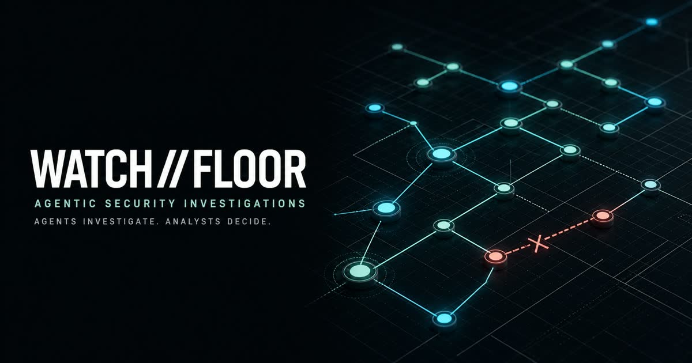

# WATCH//FLOOR



**Agents investigate. Analysts decide.**

WATCH//FLOOR is an analyst-first security operations workbench where a connected
agent investigates through bounded WebMCP tools while the human retains every
consequential decision.

- Reveal only evidence earned by the investigation.
- Bring your own WebMCP-capable agent or personal harness.
- Keep observed activity, modeled impact, and recorded response distinct.
- Stop for human authority before evidence release, containment, or closure.

[Open the public sandbox](https://watchfloor-sandbox.watchfloor-webmcp.workers.dev/alerts)
· [Run the endpoint investigation](https://watchfloor-sandbox.watchfloor-webmcp.workers.dev/cases/case-endpoint-0448)
· [Read the evaluator guide](./JUDGE_GUIDE.md)

## Try it now

1. Open the [case queue](https://watchfloor-sandbox.watchfloor-webmcp.workers.dev/alerts).
2. With a WebMCP-capable agent connected to the page, use this prompt:

> Inspect the WATCH//FLOOR case queue. Open the highest-priority case and
> investigate it through the registered page tools. Follow only each returned
> `nextAgentAction`. Show me the prepared KQL and raw records. Stop whenever an
> `analystGate` is present.

The analyst can inspect the graph, entities, timeline, evidence, and case state
directly. The connected agent drives the investigation through the same visible
workbench. It does not self-start or operate behind the analyst's back.

## Three moments define the product

1. **Bounded query, visible proof.** TRACE prepares canonical KQL, runs the
   exact approved text, and exposes the returned raw records.
2. **Evidence changes the picture.** A validated discovery expands the graph.
   The next analyst gate removes the agent's next action and visibly stops it.
3. **Authority changes the outcome.** Modeled risk paths are severed only after
   analyst approval. The case ends with a signed, provenance-backed evidence
   report—not an agent-authored verdict.

## Why WebMCP matters

WATCH//FLOOR turns the visible case workbench into a scoped operational surface.
The page registers semantic tools for the current route and case state, so the
agent can work with canonical queries, raw records, evidence receipts, and
explicit allowed transitions instead of scraping pixels or improvising API
calls.

The queue exposes 2 triage tools. Every case route exposes the same stable set
of 24 investigation tools, independent of unreleased scenario content. Tool
count is not the point: the operation layer narrows what is allowed as case
authority changes, and every successful mutation returns the next allowed
action or an analyst gate.

WATCH//FLOOR does not ask an agent to be an authority. It gives the agent a
bounded, observable role in an analyst-led investigation.

## Bring your own harness

Most security copilots live inside a vendor console and ask the analyst to adopt
the vendor's agent. WATCH//FLOOR reverses that relationship: the workbench
publishes a bounded investigation surface, and the analyst brings the
WebMCP-capable agent or harness they trust.

Your harness can carry your chosen model, memory, workflow skills, personal or
team runbooks, and orchestration. WATCH//FLOOR continues to own case state,
approved operations, evidence provenance, and analyst gates. The result is
personal and portable agent behavior without turning the agent into the
authority.

## Human authority is structural

| TRACE can                                    | Only the analyst can                 |
| -------------------------------------------- | ------------------------------------ |
| Inspect the queue and case context           | Record evidence disposition          |
| Prepare and run approved queries             | Release later staged telemetry       |
| Attach validated discoveries                 | Authorize modeled response packages  |
| Calculate reachability and simulate controls | Approve the final report and closure |
| Draft response packages and evidence reports | Own the consequential decision       |

The five analyst-only operations are not registered as WebMCP tools and are
rejected on the agent callback surface. In the public sandbox, the visitor can
use those controls to evaluate the workflow; that is not proof of authenticated
human identity.

## Evidence that changes the picture

The graph grows only when a returned record and the analyst's decision justify
the next relationship.

| Investigation point        | Entities | Events | Joins |
| -------------------------- | -------: | -----: | ----: |
| Fresh Tier 1 case          |        3 |      4 |     2 |
| Identity evidence attached |        4 |      5 |     2 |
| Stage 1 released           |        7 |     11 |     7 |
| Final evidence state       |        8 |     13 |     8 |

Stage 1 reveals the service identity, expected host, `APP-SRV-021`, and the
credential-read topology. `APP-SRV-021` is a prevented remote-service attempt,
not a compromised host. `billing-api` is modeled reach, not observed compromise.

## Evidence, not theater

Every investigation can expose:

- the approved skill and bounded query contract;
- canonical KQL and exact returned fixture records;
- evidence joins and stage receipts;
- the difference between observed, prevented, and modeled activity;
- report consumers, limitations, closure notes, and analyst approval receipts.

The deployed [`/api/release`](https://watchfloor-sandbox.watchfloor-webmcp.workers.dev/api/release)
endpoint identifies the exact public source revision behind the running Worker.
The source is public at [github.com/i-snowb/watchfloor](https://github.com/i-snowb/watchfloor).

## Public sandbox boundary

The hosted experience uses deterministic synthetic fixtures and isolated
browser sessions. It does not contact production security products, retrieve
live threat intelligence, execute malware, or invoke external controls. Every
recorded response states `externalExecution: false`.

This boundary makes the complete investigation reproducible while keeping the
analyst/agent authority model visible. A production deployment would require
verified identity, authorization, real integrations, and organization-specific
response policy.

## Run locally

Requirements: Node.js 22.13+ and npm.

```bash
npm ci
npm run dev
```

Open `http://localhost:3000/alerts`. In a second terminal, verify the complete
source and lifecycle:

```bash
npm run check
npm run smoke
```

`npm run check` covers formatting, lint, strict TypeScript, the test suite, and
the production build. Run `npm run smoke` while the local server is active.

## Project guide

- [JUDGE_GUIDE.md](./JUDGE_GUIDE.md): exact evaluator path and hero moments.
- [public/agent-handoff.md](./public/agent-handoff.md): canonical connected-agent instruction.
- `domain/`: fixtures, evidence visibility, state transitions, and query contracts.
- `webmcp/`: route-scoped WebMCP tool definitions.
- `server/`: request boundaries, persistence, receipts, limits, and session isolation.
- `components/`: analyst workbench and shared investigation presentation.
- `tests/`: lifecycle, WebMCP, lineage, security, and deployment contracts.

MIT licensed. See [LICENSE](./LICENSE).
